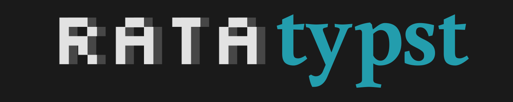

<div align="center">

<a href="https://github.com/sermuns/ratatypst">
  
</a>

_finally.. `ratatui` in Typst.._

[](https://ratatui.rs/)

</div>


This is a terribly barebones and shitty proof-of-concept for writing Ratatui apps for Typst.

Inspired by [`soviet-matrix`](https://typst.app/universe/package/soviet-matrix/)

## Try it out!

1. Use `ratatypst-core` in your Rust project:

   ```sh
   cargo add --git https://github.com/sermuns/ratatypst
   ```

2. Write a Ratatui app (see examples in `examples/`) that uses `ratatypst_core::TypstBackend` for the backend.

3. Compile the Rust code, see the [`Justfile`](Justfile) for inspiration. Make to use `wasm32-unknown-unknown` target and `#import` the `.wasm` file as a WASM plugin in your Typst code.

4. Render the PDF, either:
   - Edit the `.typ` file with [`typst-preview.nvim`](https://github.com/chomosuke/typst-preview.nvim) which can re-render a preview on every keystroke.

   - Use [`typst` CLI](https://repology.org/project/typst/versions) (**not as cool**)

     ```sh
     typst watch main.typ
     ```

     which automatically recompiles PDF everytime the `.typ` is saved with modifications.

## Disclaimer

This code is 100% certified human-slop. **No artificial intelligence was used in the making of this.**

<a href="https://brainmade.org/">
<picture>
  <source media="(prefers-color-scheme: dark)" srcset="https://brainmade.org/white-logo.svg">
  <source media="(prefers-color-scheme: light)" srcset="https://brainmade.org/black-logo.svg">
  
</picture>
</a>
